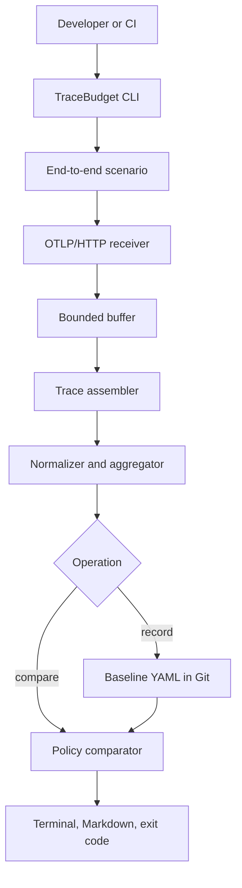

# TraceBudget — Design Specification

- **Status:** Approved by the user on 2026-08-15
- **Date:** 2026-08-09
- **Working name:** TraceBudget

## 1. Summary

TraceBudget is a local- and CI-first regression-testing tool for the runtime behavior of backend systems. It records OpenTelemetry traces produced by a named end-to-end scenario, creates a small versioned baseline, and compares later executions against that baseline.

Its central question is:

> Did this change introduce an architectural, reliability, or performance regression in this scenario?

TraceBudget is not a general trace viewer, an application-performance-monitoring platform, or a hosted observability service. Its narrow product boundary is automatic baseline-versus-candidate comparison with an actionable report and a CI exit code.

## 2. Goals

The first usable release must:

1. Let a developer record and compare a scenario from the command line.
2. Accept telemetry through the standard OTLP/HTTP protocol so applications may use any compatible language or SDK.
3. Detect new errors, new service dependencies, unexpected increases in span calls, incomplete traces, and configured latency-budget violations.
4. Produce a human-readable YAML baseline that can be committed to Git.
5. Produce terminal and Markdown reports suitable for local use and pull requests.
6. Never silently discard accepted telemetry or report a pass when known evidence is incomplete.
7. Be installable and useful as a single Go binary before any distributed deployment is introduced.
8. Provide a deliberate path from a single process to horizontally scaled ingestion and analysis, justified by published measurements.

## 3. Non-goals for the First Release

The first release will not provide:

- a hosted SaaS or multi-tenant control plane;
- a web dashboard or general-purpose trace explorer;
- production monitoring, alerting, or long-term trace retention;
- automatic application instrumentation;
- AI-generated diagnoses;
- Kafka, Kubernetes, or separately deployed workers;
- arbitrary remote-code execution;
- support for OTLP/gRPC; OTLP/HTTP is the only ingestion protocol initially.
- statistically valid comparison of sampled traces; scenarios must use always-on sampling.
- official macOS or Windows support; the first release targets Linux amd64/arm64 and Ubuntu-based CI runners.

## 4. Target Users and Primary Use Cases

The primary user is a backend developer who has an instrumented end-to-end scenario and wants to prevent a pull request from silently changing its runtime behavior.

Representative use cases include:

- detecting an N+1 database or provider-call regression;
- detecting a newly introduced synchronous service dependency;
- detecting a new error path;
- protecting the maximum number of calls to an expensive external provider;
- enforcing an explicit latency budget;
- reviewing architectural changes through a small Markdown diff instead of manually inspecting trace waterfalls.

The first dogfooding target is `trip-reality-check`. A scenario such as trip planning can protect provider/model call counts, dependency structure, error status, and latency budgets. A separate deterministic demo system will make the public quickstart independent of external credentials.

## 5. User Experience and CLI Contract

### 5.1 Record a baseline

```bash
tracebudget record trip-plan --runs 20 -- npm run test:e2e
```

The command will:

1. Start a local OTLP/HTTP receiver on an available loopback port.
2. Set `OTEL_EXPORTER_OTLP_ENDPOINT` for the child process.
3. Merge unique TraceBudget execution and run identifiers into the existing `OTEL_RESOURCE_ATTRIBUTES` value for child processes that inherit it.
4. Run the child command twenty times, assigning a distinct run identifier to each iteration.
5. Wait up to the configured flush timeout for late spans.
6. Normalize and aggregate complete traces.
7. Write `.tracebudget/trip-plan.yaml`.

If the baseline already exists, `record` will refuse to replace it unless `--force` is supplied. A failed child command or invalid telemetry will never modify an existing baseline.

### 5.2 Compare a candidate

```bash
tracebudget compare trip-plan --runs 20 -- npm run test:e2e
```

The command repeats the capture process and compares the result with `.tracebudget/trip-plan.yaml`.

Exit codes are stable API behavior:

- `0`: comparison passed;
- `1`: a regression policy was violated;
- `2`: configuration, ingestion, baseline, or child-execution failure prevented a trustworthy comparison.

### 5.3 Reports

The default terminal report is concise and groups findings by severity. Markdown output is available through:

```bash
tracebudget compare trip-plan \
  --report markdown \
  --output tracebudget-report.md \
  -- npm run test:e2e
```

A thin GitHub Action wrapper will run the CLI, upload diagnostic artifacts when requested, and publish the Markdown result as a job summary. Pull-request commenting is not required for the first release because it would introduce token and permission management without improving the comparison engine.

## 6. Architecture

The first release is one Go binary with independently testable internal components:

1. **Command supervisor** — starts the child process, injects environment variables, enforces timeouts, propagates signals, and captures its exit status.
2. **OTLP/HTTP receiver** — validates OTLP payloads and converts them to the internal span representation.
3. **Bounded ingestion buffer** — separates receiving from processing and makes overload explicit.
4. **Trace assembler** — groups spans by `traceId`, handles out-of-order arrival, deduplicates spans, and determines completeness.
5. **Normalizer** — removes unstable fields and converts complete traces into deterministic structural representations.
6. **Run aggregator** — calculates per-run counts, error rates, and duration distributions.
7. **Baseline repository** — reads and writes versioned YAML baselines.
8. **Comparator and policy engine** — classifies changes and applies configured severity rules.
9. **Reporter** — renders terminal and Markdown output and maps the result to a stable exit code.
10. **Temporary run store** — uses SQLite for bounded local persistence during capture and analysis.

The components communicate through typed interfaces. The receiver does not know baseline formats, and the comparator does not know OTLP. These boundaries allow ingestion and analysis to become separate processes later without rewriting the comparison domain.

### 6.1 Data flow



## 7. Trace Completion and Normalization

### 7.1 Correlation

The root span of each scenario trace must carry the execution and run identifiers injected by the command supervisor. Services launched as child processes inherit those identifiers through `OTEL_RESOURCE_ATTRIBUTES`. Existing or separately launched services may add the same marker through their OpenTelemetry configuration or test harness. Every service whose spans should participate in the comparison must export them to the TraceBudget receiver.

Because resource attributes can appear on every span emitted by the supervised process, automatic discovery treats only a marker-bearing span with no captured parent as a root candidate. An explicit `(service.name, span.name)` selector narrows those candidates; it does not turn a child span into a root.

Once TraceBudget discovers a marked root span, it includes every span with the same `traceId`; downstream services do not need to repeat the TraceBudget attributes because normal trace-context propagation supplies the correlation. Spans that arrive before their marked root are held temporarily in SQLite. Traces with no marked root by the end of the flush window are ignored and counted as unmatched telemetry.

The supervisor sets `OTEL_TRACES_SAMPLER=always_on` for inheriting child processes. Separately launched services must also use always-on sampling for the scenario. TraceBudget can report known missing or incomplete evidence, but it cannot detect a span discarded upstream before reaching its receiver; this limitation is stated in every baseline and report.

By default, each command iteration must produce exactly one marked root trace. During `record`, TraceBudget discovers that root and stores its `(service.name, span.name)` selector. If an iteration produces zero or multiple matching roots, the execution fails with exit code `2` and lists the candidates. Scenarios that intentionally produce multiple roots must declare their selector and expected trace count explicitly in the baseline configuration.

### 7.2 Completion

A trace becomes a completion candidate when:

- it contains a root span whose end timestamp is present; and
- no new span for that `traceId` has arrived for 500 milliseconds.

After the child process exits, the receiver remains active for a default flush timeout of five seconds. Both values are configurable. A candidate is reopened if a late span arrives before the flush window closes; finalization occurs only at the end of that window. Any remaining open trace is marked incomplete and excluded from metric aggregation.

### 7.3 Deduplication and invalid input

The identity of a span is `(traceId, spanId)`.

- An exact duplicate is ignored and counted in diagnostics.
- A duplicate identity with different content is an ingestion conflict and causes exit code `2`.
- A malformed OTLP request returns an error and causes exit code `2` for the execution.
- A span with a negative duration or a missing required identity is invalid and causes exit code `2`.

### 7.4 Structural identity

IDs and absolute timestamps never enter the baseline. A normalized node is identified by:

```text
(service.name, span.name, span.kind)
```

A normalized edge is a parent-node-to-child-node relationship. An edge whose endpoints have different `service.name` values is a cross-service dependency. A new client span without a downstream server span is still visible as a new node and occurrence in the caller. For each node and edge, TraceBudget records its occurrence distribution per complete trace.

Attribute values are excluded by default because they can be unstable, high-cardinality, or sensitive. A scenario may explicitly allowlist safe attributes for comparison. No non-allowlisted attribute value is written to the baseline.

## 8. Baseline and Policy Model

The baseline is stored at `.tracebudget/<scenario>.yaml` and contains:

- schema version and scenario name;
- root-span selector and expected trace count per run;
- number of successful runs and complete traces;
- normalized nodes and edges;
- per-trace occurrence distributions;
- observed error rates;
- observed p50 and p95 durations for informational context;
- explicit comparison policies and latency budgets.

Example:

```yaml
schema_version: 1
scenario: trip-plan
runs: 20

root:
  service: planner
  span: trip.plan
  expected_per_run: 1

policies:
  new_service_edge: fail
  new_external_dependency: fail
  new_internal_node: warn
  new_error: fail
  removed_node: warn
  removed_edge: warn
  count_increase: fail
  latency_increase: warn
  incomplete_trace_rate:
    max: 0

budgets:
  spans:
    - service: planner
      name: planner.build
      p95: 600ms
    - service: planner
      name: provider.search
      max_per_trace: 1
  max_error_rate: 0
```

The generated file also contains the observed structural and metric summary below these policies. A schema version makes future migrations explicit. An unsupported newer schema fails with exit code `2` and never attempts a partial comparison.

## 9. Default Comparison Semantics

| Candidate change | Default result |
| --- | --- |
| New error | Fail |
| New edge between services | Fail |
| New `CLIENT` or `PRODUCER` span | Fail |
| New `INTERNAL` span | Warn |
| Span or edge count beyond recorded range | Fail |
| Incomplete-trace rate above configured maximum | Fail |
| Removed node or edge | Warn |
| Latency increase without an explicit budget | Warn |
| Explicit latency-budget violation | Fail |

Latency is not a blocking signal by default because CI machines are noisy. Blocking p95 budgets require at least twenty complete samples. If fewer samples are available, TraceBudget returns exit code `2` rather than silently passing or using an unreliable percentile.

Percentiles use the deterministic nearest-rank method over individual normalized span-duration samples. An error is recorded when a span has OpenTelemetry status `ERROR` or contains an OpenTelemetry exception event.

Structural policies use per-trace counts and normalized graph relationships, not exact execution ordering. This avoids treating harmless scheduling variation as a regression.

## 10. Overload, Cancellation, and Failure Handling

- The ingestion buffer defaults to 10,000 spans and is configurable.
- If a received batch cannot fit without exceeding the limit, the receiver returns an overload error and sets an irreversible integrity-failure flag for that execution. A later SDK retry cannot turn that execution into a pass; it ends with exit code `2`.
- Telemetry is never silently dropped.
- The command supervisor applies a configurable child timeout. On timeout or cancellation, it terminates the child process group, keeps the receiver alive for the flush timeout, records diagnostics, and exits with code `2`.
- SQLite writes are batched. A persistence error stops ingestion and invalidates the comparison.
- A missing baseline causes `compare` to fail with exit code `2` and an instruction to run `record`.
- A nonzero child exit status is reported separately from a TraceBudget policy violation and produces exit code `2`.
- Raw traces are deleted after a successful run by default. `--keep-artifacts` retains a local diagnostic artifact explicitly.

## 11. Privacy and Security

TraceBudget binds its receiver to the loopback interface by default. It does not execute code received over the network; it only runs the local command supplied by the user.

Baseline files contain structural identifiers and explicitly allowlisted attributes, not arbitrary span attributes or payloads. The documentation will warn that service and span names can still reveal architecture and must be reviewed before committing a baseline to a public repository.

Temporary SQLite data is local and deleted by default. Remote ingestion, authentication, tenant isolation, and untrusted code execution are out of scope for the first release.

## 12. Self-observability

TraceBudget will expose its own execution diagnostics in the final report:

- spans received, deduplicated, invalid, and incomplete;
- current and peak buffer depth;
- trace assembly delay;
- SQLite batch-write duration;
- normalization and comparison duration;
- number of complete samples used per metric.

Structured debug logs are available through `--verbose`. A successful result includes enough diagnostics to establish that the evidence was complete.

## 13. Demonstration System

The repository includes a deterministic Docker Compose demo with two services and PostgreSQL. It provides four controlled variants:

1. baseline behavior;
2. repeated database or downstream call;
3. newly introduced synchronous dependency;
4. injected latency and error.

The quickstart records the baseline, selects one regression variant, runs `compare`, and shows the resulting report. The demo requires no cloud credentials or external paid service.

## 14. Testing Strategy

### 14.1 Unit tests

- normalization and structural fingerprinting;
- graph and occurrence aggregation;
- policy classification;
- YAML serialization and schema-version handling;
- percentile and minimum-sample rules;
- report and exit-code mapping.

### 14.2 Protocol and integration tests

- valid and malformed OTLP/HTTP payloads;
- duplicates and conflicting duplicate identities;
- spans arriving out of order and after the root span;
- incomplete traces and flush-timeout behavior;
- receiver overload and SQLite failures;
- child success, failure, timeout, and cancellation.

### 14.3 End-to-end tests

The demo system must prove detection of all four controlled variants. Structural comparisons must produce the same finding across fifty repeated executions; latency values may vary, but their configured classification must remain stable.

### 14.4 Load and failure tests

A deterministic generator will publish increasing span rates and document:

- maximum sustained ingestion rate on the reference machine;
- memory use and peak buffer depth;
- assembly latency;
- behavior at saturation;
- recovery after abrupt child-process termination.

The project will publish methodology and raw benchmark results rather than an unsupported marketing throughput number.

## 15. Delivery Sequence

### Phase 1 — Vertical slice

Receive one complete OTLP trace, normalize it, write a baseline, compare a second trace, and render one finding.

### Phase 2 — Reliable pipeline

Add the command supervisor, multiple runs, bounded buffering, SQLite batching, out-of-order assembly, deduplication, completion rules, and failure semantics.

### Phase 3 — Usable CI product

Stabilize the CLI and YAML schema, add Markdown output, publish the GitHub Action and binary releases, finish the deterministic demo, and write the quickstart.

### Post-1.0 validation — Dogfooding and evidence

Instrument and use TraceBudget in `trip-reality-check`, publish a real regression case, run the load/failure suite, and document limits and architectural decisions.

### Separate follow-up design — Distributed evolution

Only after post-1.0 measurements identify a relevant bottleneck, write an ADR and split ingestion from analysis. The distributed design will:

- run multiple ingesters;
- partition work by `traceId` so spans from one trace converge on the same logical assembler;
- use a durable queue selected through an explicit comparison and benchmark;
- make analysis idempotent;
- define rebalancing, retry, retention, and overload behavior;
- preserve the local single-binary mode.

Distributed evolution is not part of the first implementation plan. After measurements identify a relevant bottleneck, it receives its own ADR, specification, review, and implementation plan. The broker and orchestration platform are intentionally not selected here because their selection must follow measured requirements.

## 16. Acceptance Criteria for the First Release

The first release is complete when:

1. A developer can install one binary and complete the demo quickstart without cloud credentials.
2. `record` and `compare` follow the documented CLI and exit-code contracts.
3. The demo reliably detects repeated calls, a new dependency, a new error, and an explicit latency-budget violation.
4. The tool fails explicitly on invalid, incomplete, overloaded, or insufficient evidence according to policy.
5. Baselines contain no arbitrary span attribute values and remain small enough for normal Git review.
6. Unit, integration, end-to-end, and failure tests pass in CI.
7. A GitHub Action integration produces a useful Markdown job summary.
8. Benchmark methodology, limitations, and architectural trade-offs are documented publicly.

## 17. Key Design Decisions

1. **OTLP rather than a custom tracing SDK:** keeps the tool language-independent and teaches an industry protocol.
2. **Single binary first:** creates a usable product and measurable baseline before distributed infrastructure.
3. **Structural regressions are strict; latency is opt-in strict:** protects CI stability.
4. **No silent internal telemetry loss:** any known incomplete evidence invalidates the comparison; upstream SDK loss remains an explicit limitation.
5. **Summary in Git, raw telemetry temporary:** balances reviewability, privacy, and storage.
6. **Distributed mode preserves local mode:** scaling work must not degrade the simple developer experience.
